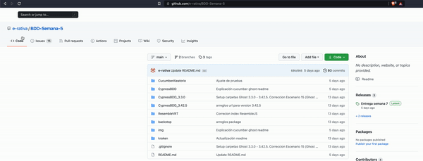
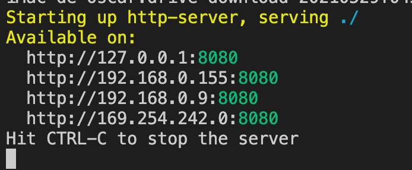
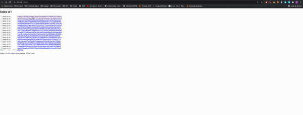
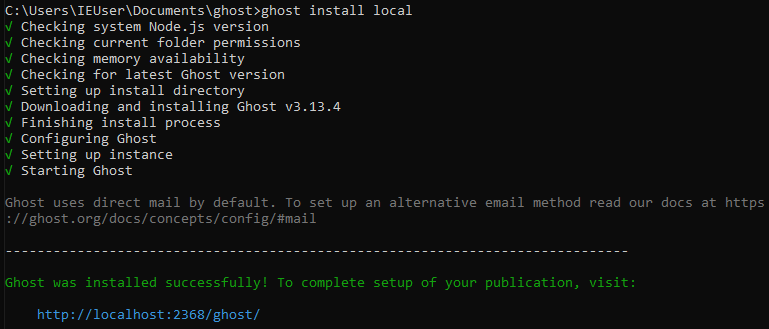
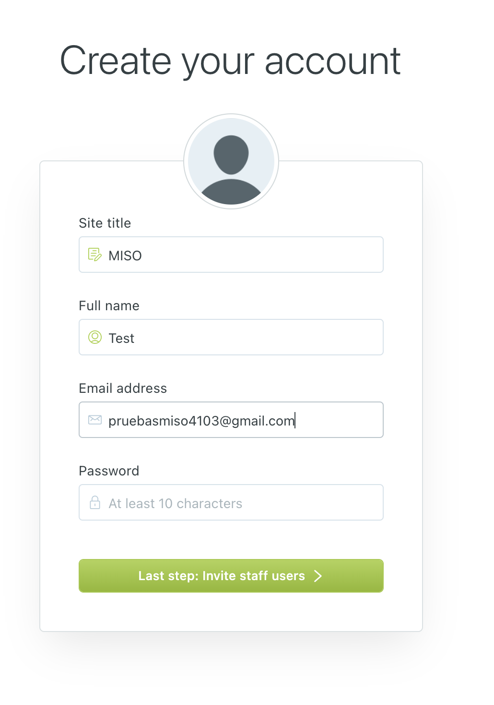
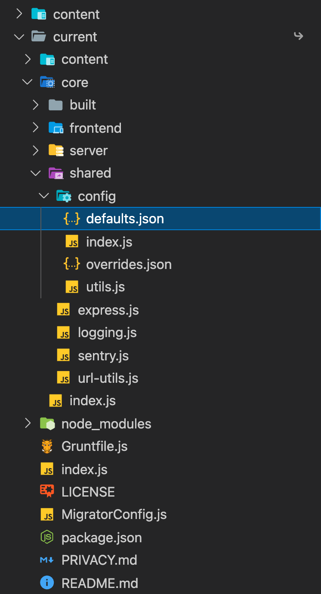
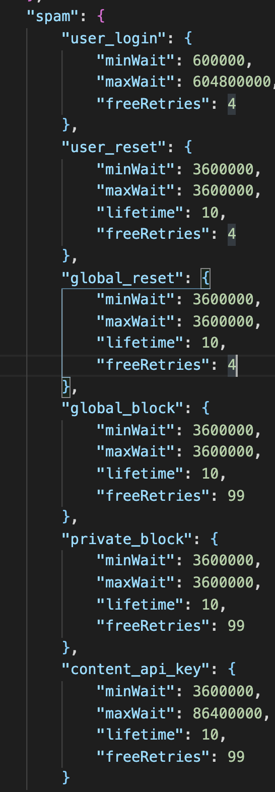

# Pruebas Automatizadas - Grupo 4-ywj
---
# Semana 8 
---
**Para ver la información referente a como se realizaron las pruebas, en las estrategías y información adicional del proyecto por favor diríjase a la wiki.**




## Ver reportes de kraken

Para ver los reportes de kraken es encesario tener instalado **NodeJs** e instalar el siguiente paquete ejecutando este comando:


```bash
npm i http-server
```

Ahora descargue los reportes generados por **Kraken** en este [link](https://drive.google.com/drive/folders/1YaNVaxDF4ddG_X8tl_wWZMvsvKGoaLfa).

Luego entre por consola en la carpeta donde realizo la descarga:

```bash
cd Descargar/${rutaCarpeta}
```

Luego corra el comando:

```bash
http-server
```


Luego ingrese en un navegador a la url [http://127.0.0.1:8080](http://127.0.0.1:8080).

Donde cada carpeta que aparecen son cada una de las ejecusiones de los escenarios de **Kraken**



# Cypress VRT 

Para la generación de reportes VRT utilizando los screenshots generados de las pruebas con Cypress se debe tener en cuenta la siguiente información.

## Requerimientos

Se necesita instalar mínino la versión 10 de node js, este trae npm necesario para correr las pruebas.

## Screenshots Ghost v3.3.0

### Instalar las dependencias del proyecto.

Primero navegar a la carpeta CypressBDD_3.3.0/cypress con el comando de navegación por consola

```bash
cd CypressBDD_3.3.0/
```

Para instalar las dependencias del proyecto se corre el siguiente comando:

```bash
npm install
```

### Correr el test de cypress

Para correr el test se ejecuta el siguiente comando para abrir la interfaz gráfica:

```bash
./node_modules/cypress/bin/cypress open
```

### Luego de esto se puebra una lista con cada especificación, **por favor ejecutar una a una**

Al terminar la ejecución de las pruebas se generan los screenshots especificados que podrán ser accedidos en la ruta:

```bash
CypressBDD_3.3.0/cypress/screenshots/
```
En esta ruta se encontran las carpetas de cada escenario ejecutado con los screenshot respectivos.


## Screenshots Ghost v3.42.5

### Instalar las dependencias del proyecto.

Primero navegar a la carpeta CypressBDD_3.42.5/cypress con el comando de navegación por consola

```bash
cd CypressBDD_3.42.5/
```

Para instalar las dependencias del proyecto se corre el siguiente comando:

```bash
npm install
```

### Correr el test de cypress

Para correr el test se ejecuta el siguiente comando para abrir la interfaz gráfica:

```bash
./node_modules/cypress/bin/cypress open
```

### Luego de esto se puebra una lista con cada especificación, **por favor ejecutar una a una**

Al terminar la ejecución de las pruebas se generan los screenshots especificados que podrán ser accedidos en la ruta:

```bash
CypressBDD_3.42.5/cypress/screenshots/
```
En esta ruta se encontran las carpetas de cada escenario ejecutado con los screenshot respectivos.

---

# Kraken BDD test

BDD test para entrega semana 6 calificada de pruebas automatizadas MISO.

## Requerimientos

Recomendación si no ha trabajado con consola, empiece a familiarizarse con los comandos básicos. Una lista de comandos básicos UNIX los puede encontrar:

https://mally.stanford.edu/~sr/computing/basic-unix.html.

## Instalar las dependencias del proyecto

1​. Creamos una máquina virtual de VirtualBox en cual Kraken esta instalado y funcionando. La puede encontrar en la siguiente url y la clave es "pruebas": https://zenodo.org/record/4739209/files/Ubuntu20Light_copy.vdi?download=1

1.1. Ejecuten el entorno como Administradores para evitar errores

2​. En caso de querer ejecutar Kraken por su cuenta, se le recomienda usar Windows. Ejecuten el entorno como Administradores para evitar errores

2​.1. Ejecuten el entorno como Administradores para evitar errores

2.2. La version de ruby: cualquiera entre 2.2.X y 2.7.2

2.3. Asegurense de tener un chromium/chrom referenciado en sus variables path (va a fallar en la creacion de carpetas)

2.4. Para el error too many login attempts en kraken:

2.4.1. Opción 1: ​Crear un archivo config.development.json en el directorio raíz del proyecto y añadir:

```bash
{
 "spam": {
   "global_block": {
     "freeRetries": 100000000
   },
   "user_login": {
     "freeRetries": 100000000
   }
 }
}
```

2.4.2. Opción 2: Vaciar la carpeta brute de la db.

3.  En caso de hacer uso de Ubuntu puede seguir los pasos que se encuentran en el siguiente archivo: https://bit.ly/3362dRl Fueron los que seguimos para la creación de la máquina virtual del punto 1.

## Configuración del ambiente

Copiar los archivos **.feature** que se encuentran en la ruta **kraken/\*.feature** en la carpeta del ambiente kraken previamente instalado en la ruta
**/features**.

Kraken necesita reconocer los dispositivos que representan a cada usuario en la prueba que
se va a ejecutar, ya sean dispositivos Android (en caso de que se prueben aplicaciones móviles),
o navegadores web (en caso de que se prueben aplicaciones web).
Para esto, es necesario que se copie el archivo de **llamado kraken_mobile_settings.json** que se encuentra en la ruta
**kraken/llamado kraken_mobile_settings.json**.
Este archivo también se puede generar automáticamente con la utilidad de línea de comandos de kraken-mobile. Ejecute el siguiente comando:

```bash
kraken-mobile setup
```

**Por favor si lo hace por este comando crear 5 usuarios y todos web**

**Dentro de la carpeta de Kraken se encuentra la declaración de los web_steps utilizados para la generacion de los screenshots. Por favor remplace el archivo existente en la carpeta del "definitions_steps/web_steps".**

## Correr las pruebas kraken

En el ambiente de kraken previamente configurado por favor correr el siguiente comando:

```bash
bundle exec kraken-mobile run
```
---
# Backstop

## Instalación backstop

Para instalar si aún no lo tiene instalado el backstop correr el siguiente comando.

```bash
npm install -g backstopjs
```

## Configuración del ambiente

Para correr la comparativa de backstop para las pruebas de regresión visuales (vrt) se accede a la carpeta **backstop** y correr los siguientes comandos.

```bash
backstop init
```

Esto creará los archivos necesario para crear el reporte y la comparativa de las evidencias, para utilizar la herramienta copiar las 2 carpetas a comparar, igualmente en la carpeta **backstop** 
(e.g.  **backstop/carpeta1** | **backstop/carpeta1**) 

```bash
npm install
```

Para instalar los módulos necesarios para ejecutar el proceso.

**IMPORTANTE** estás tienen que tener unas carpetas internas donde se evidencien los escenarios y dentro de dichas carpetas las respectivas capturas.

**Correr backstop**

```bash
node executeTest.js carpeta1 carpeta2
```

**Nota**:

para nuestro caso concreto se puede correr el siguiente comando:

```bash
node executeTest.js Ghost_3.3.0 Ghost_3.42.5
```

- Este comando se puede demorar si el número de imagenes es muy grande.
- Se debe esperar hasta que el reporte se refresque por segunda vez y el proceso en la consola termine completamente.


---
# Resemble JS

## Instalación resemble

Para instalar si aún no lo tiene instalado el resembleJs desplazarse a la carpeta ResembleVRT con el comando 

```bash
cd ResembleVRT
```
Después de esto correr el siguiente comando.

```bash
npm install
```

## Configuración del ambiente

Para correr la comparativa de resemble para las pruebas de regresión visuales (vrt) se accede a la carpeta **ResembleVRT** y correr el siguiente comando.

**IMPORTANTE** estás tienen que tener unas carpetas internas donde se evidencien los escenarios y dentro de dichas carpetas las respectivas capturas, con nombre de las versiones GHOST 3.3.0 y GHOST 3.42.5

**Correr resemble**

```bash
node index.js
```

**Nota**:

Este comando se puede demorar si el número de imágenes es muy grande.

---
# Cucumber - Pruebas con datos y escenarios aleatorios.

## Instalación Cucumber

Para instalar si aún no lo tiene instalado el cucumber desplazarse a la carpeta CucumberAleatorio con el comando 

```bash
cd CucumberAleatorio
```
Después de esto correr el siguiente comando.

```bash
npm install
```

## Configuración del ambiente

Para correr las pruebas primero necesitamos 3 pasos:

- Instalar una instancia del Ghost versión 3.42.5 (Si aún no la tiene instalada).
- Configurar el Ghost para que permita más de 100 intentos.
- Correr las pruebas de cucumber aleatoreas

### 1. Instalar versión Ghost 3.42.5 

Para isntalar la versión del ghost en la versión 3.42.5 por favor siga los siguientes pasos: 

Abra una terminal en su máquina. Desde ella invocará el comando que descarga, de forma global, Ghost-CLI haciendo uso de su manejador de paquetes. En el caso de npm, escriba el comando:

```bash
npm install -g ghost-cli@latest
```

En el caso de yarn, escriba el comando:

```bash
yarn global add ghost-cli@latest
```

Una vez tenga en su computador instaladas las herramientas de Ghost-CLI, diríjase a un directorio vacío en su sistema de archivos, el cual dedicará exclusivamente a Ghost. Puede hacer esto desde el directorio en el que está ubicado actualmente con los siguientes comandos:

```bash
mkdir ghost - para crear el nuevo directorio;
```

Y después corra 

```bash
cd ghost 
```


Ahora que su terminal está ubicada en el directorio deseado, ejecute el comando de instalación con las herramientas que recién descargó:

```bash
ghost install 3.42.5 local
```
El resultado en la consola va a contener varias líneas confirmando el éxito de cada paso de la instalación, y una línea indicando que la instalación fue exitosa, como se muestra a continuación:

 

Para probar la aplicación y su funcionamiento, abra su navegador y escriba en la barra de navegación la siguiente dirección:

[http://localhost:2368](http://localhost:2368)

Y crear el usuario con las siguiente credenciales: 


 

Y con la contraseña **qwerty1234**  

# 2. Configurar el ghost para evitar problemas con la sesión:

En la carpeta donde previamente instalo el ghost dirijase al siguiente archivo y abralo en su editor de texto favorito.

 

En dicho archivo encontrará la propiedad spam cambie todas las propiedades **"lifetime"** de los hijos al valor de diez como se muestra a continuación:

 

# 3. Correr las pruebas de cucumber aleatoreas:

Para correr las pruebas de cucumber para las pruebas de datos y escenario aleatorios se accede a la carpeta **CucumberAleatorio** y correr el siguiente comando.


**Correr cucumber**

```bash
npm test
```

**Nota**:

La ejecucion de este comando puede tomar tiempo para finalizar su respuesta, debido al número de pruebas


